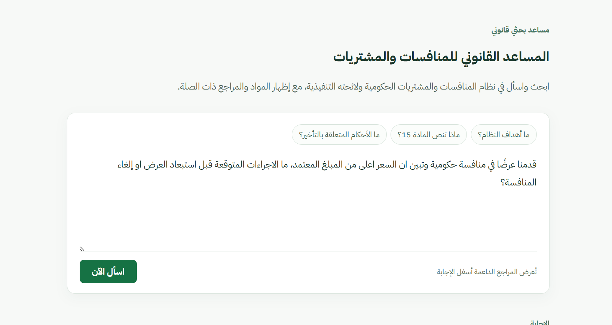
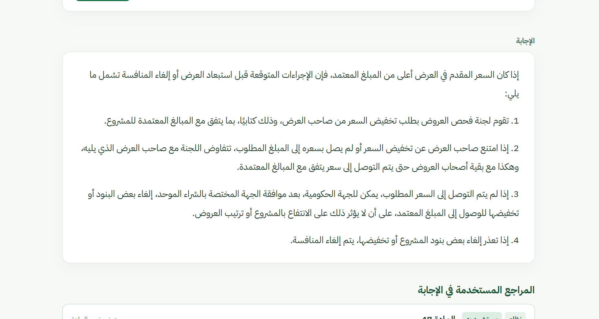
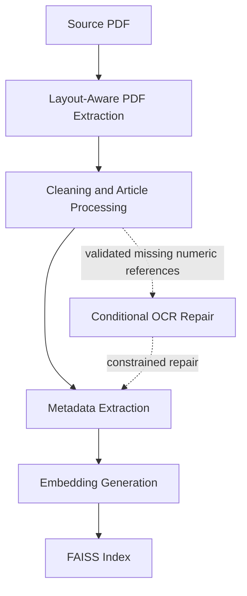
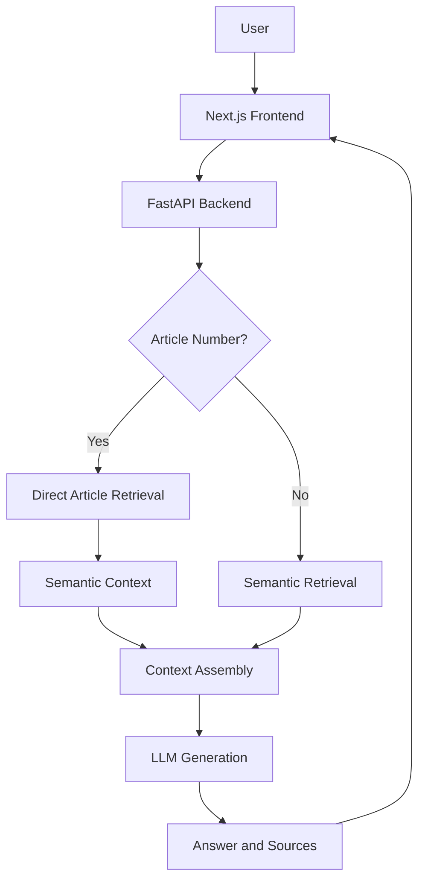

# Saudi Government Procurement RAG Assistant

## Overview

This project is an end-to-end RAG application for the **Saudi Government Tenders and Procurement Law** and its **Executive Regulations**, designed to answer natural-language questions while keeping responses connected to their regulatory sources.

Users may know the procurement question they need answered without knowing the relevant article number, regulatory term, or exact wording used in the source. They may want to understand a specific provision, explore a procurement scenario, or find where a particular case is addressed.

Navigating these regulations involves more than matching a question to text. The content follows a defined legal structure, spans two related sources, and includes overlapping article numbers that may refer to different provisions. Preserving these distinctions is essential for retrieving the right context and tracing it back to its source, making the regulations a practical use case for **structured and semantic retrieval in an Arabic RAG system**.

## Demo

Ask procurement questions in natural language and review generated answers alongside their supporting regulatory sources.

### Ask a question



### Review the answer and its sources



## Example Queries

The following examples show actual responses generated by the application from the indexed Law and Executive Regulations.

### Direct Article Lookup

**Question**

> ماذا تنص المادة 24؟

**Answer**

> توجد مادة بالرقم نفسه في النظام واللائحة التنفيذية.
>
> **النظام — المادة 24**
>
> تحدد الجهة الحكومية في وثائق المنافسة معايير تقييم ومقارنة وقبول العروض وفقًا لما توضحه اللائحة.
>
> **اللائحة التنفيذية — المادة 24**
>
> مع مراعاة ما ورد في المادة (الثانية والعشرون) من النظام، تلتزم الجهة الحكومية عند وضعها للشروط والمواصفات بما يلي:
>
> 1. عدم الإشارة إلى النوع أو الوصف أو الصنف أو الرقم الوارد في قوائم الموردين.
> 2. عدم تحديد علامات تجارية معينة أو مواصفات لا تنطبق إلا على منتج معين.
> 3. عدم التعاقد على أعمال غير محددة كمياتها أو فئاتها أو مواصفاتها في العقد، ما لم ينص على ذلك في النظام أو هذه اللائحة.

### Natural-Language Retrieval

**Question**

> ما أهداف النظام؟

**Answer**

> 1. تنظيم الإجراءات ذات الصلة بالأعمال والمشتريات، ومنع استغلال النفوذ وتأثير المصالح الشخصية فيها، وذلك حماية للمال العام.
> 2. تحقيق أفضل قيمة للمال العام عند التعاقد على الأعمال والمشتريات وتنفيذها بأسعار تنافسية عادلة.
> 3. تعزيز النزاهة والمنافسة، وتحقيق المساواة، وتوفير معاملة عادلة للمتنافسين، تحقيقًا لمبدأ تكافؤ الفرص.
> 4. ضمان الشفافية في جميع إجراءات الأعمال والمشتريات.
> 5. تعزيز التنمية الاقتصادية.

## System Architecture

### Offline Ingestion and Indexing



The ingestion pipeline reconstructs positioned Arabic PDF text into article-level documents, preserves regulatory metadata, and writes embeddings to a local FAISS index.

### Runtime Question Answering



At runtime, the Next.js application proxies questions to FastAPI. The backend routes retrieval, assembles the regulatory context, generates the answer, and returns both the answer and display-ready source metadata.

## Retrieval & Engineering Design

### Retrieval Routing and Metadata

The application does not force every request through vector similarity search. For an explicit article reference, `article_search()` resolves the article directly from `ARTICLE_INDEX`, which is built from FAISS document-store metadata. `hybrid_search()` then adds semantic results as supporting context before generation.

For a natural-language question where the relevant article is unknown, `semantic_search()` embeds the question with the `query:` prefix required by `intfloat/multilingual-e5-large` and queries FAISS for relevant provisions.

Each indexed document carries its source type, article number, chapter (`bab`), and section (`fasl`). When the Law and Executive Regulations use the same article number and the user does not name a source, the service preserves both exact matches, instructs the model to answer them separately, and returns both source records to the interface.

### Arabic PDF Processing

The source PDF uses Arabic right-to-left text and parallel document columns. `pdfplumber` word coordinates are reconstructed into logical lines before article processing to better preserve article boundaries that may be lost during linear text extraction.

Tesseract OCR is used only as a constrained repair path for validated missing numeric references; it does not replace article text indiscriminately.

### Source-Grounded Generation

The LLM receives retrieved document text as its regulatory context and emits an internal source marker alongside its answer. The backend validates cited source/article pairs against the retrieved documents, flags unverified citations, and returns citation status, metadata, and cleaned excerpts for the interface.

## Tech Stack

### Backend

- Python
- FastAPI
- OpenAI API
- LangChain
- Hugging Face Embeddings
- FAISS
- pdfplumber
- Tesseract OCR

### Frontend

- Next.js
- React
- TypeScript

### Infrastructure

- Docker
- Docker Compose

## Project Structure

```text
backend/
├── app/
│   ├── ingest.py         # PDF processing, metadata extraction, and indexing
│   ├── retriever.py      # FAISS loading and direct/semantic retrieval
│   ├── service.py        # Query routing and response orchestration
│   ├── llm.py            # Grounded generation and citation-marker handling
│   └── api.py            # FastAPI HTTP interface
├── data/                 # Regulatory source document
├── scripts/              # Index rebuild and ingestion audit utilities
└── requirements.txt

frontend/
├── app/                  # Next.js page and backend proxy route
├── components/           # Question, answer, and source UI components
└── package.json

docker-compose.yml
```

## Running Locally

### Prerequisites

- Python 3.12 or a compatible version
- Node.js compatible with Next.js 15
- An OpenAI API key for the backend
- Tesseract with Arabic language data when rebuilding the FAISS index

### Backend

From `backend/`:

```bash
python -m venv .venv
# Activate the virtual environment for your shell.
python -m pip install -r requirements.txt
cp .env.example .env
python -m uvicorn app.api:app --host 127.0.0.1 --port 8000
```

Set `OPENAI_API_KEY` in `backend/.env`. On Windows PowerShell, use `Copy-Item .env.example .env` instead of `cp`. Keep `.env` local; it is ignored by Git.

### Frontend

In a second terminal:

```bash
cd frontend
cp .env.example .env.local
npm ci
npm run dev
```

For local development, set `BACKEND_URL=http://localhost:8000` in `frontend/.env.local`. Open the URL printed by Next.js, typically `http://localhost:3000`.

### Rebuilding the Index

The generated FAISS index is intentionally ignored by Git. After replacing `backend/data/mapping.pdf`, run the following from `backend/` with the Python environment active:

```bash
python scripts/rebuild_index.py
```

### Docker Compose

From the repository root, after configuring `backend/.env` and building the local index, run:

```bash
docker compose up --build
```

Open `http://localhost:3000`. Docker Compose connects the frontend to the backend service internally and exposes both services on ports 3000 and 8000.

## Disclaimer

This is an engineering and technical project. Generated answers are not legally binding interpretations; consult official regulatory sources and qualified professionals for legal or procurement decisions.